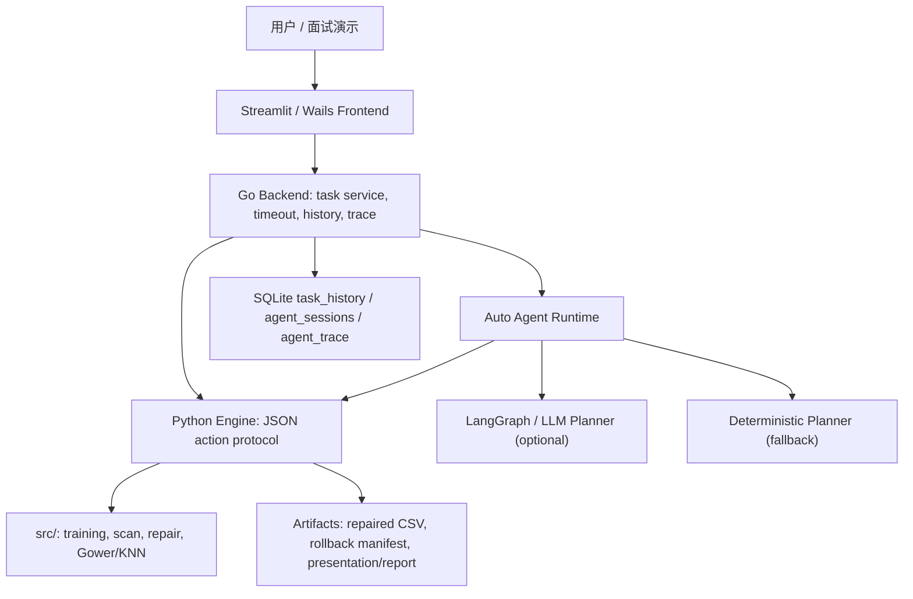

# 技术面试项目讲解手册：混合类型数据异常检测与修复系统

> 使用方式：面试前先背第 1 节的 30 秒 / 2 分钟版本；技术追问时看第 3-9 节；被问项目不足、AI 安全、指标解释时看第 10-12 节。

## 1. 项目介绍话术

### 30 秒版本

我做的是一个面向混合类型 CSV 表格数据的异常检测与自动修复系统。它不是只训练一个模型，而是做了一个完整的数据质量闭环：输入 CSV 后，系统会扫描缺失值、数值离群、稀有类别、重复记录和跨列一致性问题，生成结构化问题清单；对低风险问题执行批量修复或 Gower/KNN 近邻修复；修复后再复扫验证，并生成 rollback manifest，确保用户不满意时可以回滚。

工程上项目分为 Python Engine、Go Backend 和 Wails/Streamlit 展示层。后续我还做了 Auto Agent 增强，用 LangGraph/LLM 只做规划和解释，真正写文件仍然走确定性工具层，并且支持 fallback、trace 和 validation gate。

### 2 分钟版本

这个项目解决的是混合类型表格数据的数据质量治理问题。真实 CSV 往往既有数值列，也有类别列、时间列和业务派生列，所以异常不仅是数值离群，还包括缺失值、稀有类别、重复记录、跨列不一致等。如果直接拿这种数据去建模，后续模型或统计分析会被污染。

我的系统采用分层架构：

- Python 核心算法层负责训练、扫描、修复和回滚。
- Python Engine 通过 JSON action 协议暴露 `health / train / scan_file / repair / repair_batch / repair_with_gower / rollback_repair_batch`。
- Go Backend 负责任务编排、进度、超时取消、SQLite 历史和 agent trace。
- Streamlit 保留为旧版演示入口，Wails 是桌面应用路径。

算法上，训练和解释使用 LightGBM 与 SHAP；异常扫描用规则和统计策略；修复分为规则批量修复和 Gower 距离 + KNN 近邻修复。Gower 的价值是它能同时处理数值字段和类别字段，比单纯欧氏距离更适合 mixed-type 数据。

为了证明系统有效，我构造了可控异常注入实验。M1 生成 100 条 ground truth 异常；M2 检测评估整体 recall 是 1.0，但 numeric outlier 误报较多，整体 precision 是 0.450450；M3 修复评估中 72 条可自动修复真值全部被修改，17 条 exact restore，41 条 exact 或 improved。这个结果我没有夸大，而是把数值离群误报和副作用如实记录，说明系统更重视可证明和可回滚。

### 5 分钟版本

可以按下面顺序展开：

1. 背景：混合类型表格数据常见于医疗、交易、用户画像、设备日志等场景，数据质量问题会影响分析和建模。
2. 目标：不是单点模型，而是“检测 -> 修复 -> 验证 -> 回滚 -> 报告”的完整闭环。
3. 架构：Python 负责确定性算法和 action 协议；Go 负责任务编排和可观测性；前端负责展示；Auto Agent 只做规划与解释，不直接写文件。
4. 算法：LightGBM/SHAP 用于建模和解释；规则扫描覆盖典型异常；Gower/KNN 用于 mixed-type 近邻修复建议。
5. 工程难点：跨语言进程边界、JSON 协议稳定性、长任务超时取消、修复回滚、LLM fallback、指标口径统一。
6. 实验：M1 ground truth、M2 检测指标、M3 修复指标、Auto Agent live/fallback/multi-dataset benchmark。
7. 边界：数值离群 precision 低，重复记录和跨列一致性默认人工复核，LLM 有延迟，所以系统保留 deterministic fallback 和 validation gate。

## 2. 一句话定位

这是一个面向混合类型表格数据的异常检测与修复系统，核心价值是把 CSV 数据质量治理做成可复现、可解释、可验证、可回滚的工程闭环。

### 解决的问题

- 用户很难手工检查大型 CSV 中的缺失值、异常值、罕见类别、重复记录和跨列冲突。
- 混合类型数据不能只用纯数值距离或单一模型处理。
- 自动修复存在风险，需要验证、审计和回滚机制。
- 面试或答辩中需要用真实实验指标证明系统不是“能跑就行”。

### 目标用户

- 数据分析人员：快速发现 CSV 数据质量问题。
- 机器学习工程师：在建模前清洗和验证数据。
- 学生或研究者：需要可复现实验、指标和论文/答辩材料。

### 输入与输出

| 阶段 | 输入 | 输出 |
|---|---|---|
| 扫描 | mixed-type CSV、scan config | issue list、scan summary、列级风险、热点片段 |
| 修复 | CSV、selected issue IDs、repair strategy | repaired CSV、comparison、modified cells、rollback manifest |
| 复扫验证 | 修复后 CSV、原扫描结果 | before/after issue items、resolved issue items、validation verdict |
| 报告 | 计划、执行、验证、trace | Markdown report、JSON artifacts、可解释摘要 |

## 3. 系统架构

### 总体结构



### 各层职责

| 层 | 代表文件/目录 | 面试讲法 |
|---|---|---|
| Streamlit 演示入口 | `app.py` | 旧版算法演示入口，用于快速展示训练、检测、修复和图表 |
| Python 核心算法 | `src/` | 训练、修复搜索、Gower/KNN 近邻建议、工具函数 |
| Python Engine | `appshell/core/python_engine/` | 稳定 JSON 协议边界，承接 Go 或命令行调用 |
| Go Backend | `appshell/backend/` | 任务编排、进度、超时、取消、历史、Wails 绑定、Agent Runtime |
| Wails Frontend | `appshell/frontend/` | 桌面端产品化路径，展示扫描、修复、历史和 presentation bundle |
| LangGraph Sidecar | `appshell/core/langgraph_sidecar/` | 可选 LLM 规划和解释服务；失败时 fallback |
| 实验与报告 | `data/experiments/`、`demo/`、`outputs/auto_agent/` | 真实指标、演示请求、benchmark 摘要 |

### 为什么这样分层

- Python 更适合机器学习、pandas 数据处理和算法实验。
- Go 更适合长任务编排、超时取消、并发控制和桌面后端稳定性。
- JSON action 协议让 Python 算法和 Go 编排解耦，后续能接命令行、Wails 或 Auto Agent。
- LLM 只放在 planner/cognition 层，不直接改 CSV，避免黑盒写入。

## 4. 核心业务流程

### 主流程

```text
CSV 输入
  -> scan_file 整表扫描
  -> 生成 issue list 和 scan summary
  -> planner / 用户选择可修复 issue
  -> repair_batch 或 repair_with_gower
  -> 写出 repaired CSV 和 rollback manifest
  -> 对 repaired CSV 复扫
  -> validation gate 判断 accept / warn / reject
  -> 输出 report、trace、artifacts
  -> 必要时 rollback_repair_batch
```

### 面试中要强调的闭环

- 检测不是终点，修复后必须复扫。
- 修复不是盲写，写出后必须有 rollback manifest。
- LLM 不是执行者，只能给计划和解释。
- 高风险异常不强行自动修，宁可进入 manual review。

## 5. 核心 action 协议

Python Engine 当前稳定支持：

| Action | 作用 | 面试解释 |
|---|---|---|
| `health` | 检查 Python、依赖、支持 action | 启动自检和环境诊断 |
| `train` | 训练 LightGBM 模型 | 支持 classification/regression/auto |
| `scan_file` | 扫描 CSV 异常 | 生成 issue catalog 和统计摘要 |
| `repair` | 单样本修复 | 基于模型和候选搜索的单条修复 |
| `repair_batch` | 批量规则修复 | 按 issue IDs 执行缺失值、离群、稀有类别等修复 |
| `repair_with_gower` | Gower/KNN 修复 | 为 mixed-type 数据提供近邻证据和修复候选 |
| `rollback_repair_batch` | 回滚修复输出 | 根据 rollback manifest 恢复修复产物 |

面试回答模板：

> 我把 Python 算法能力收敛成稳定 action，而不是让 Go 或前端直接调用内部函数。这样边界清楚，测试也更容易写。新增 Auto Agent 后也只是注册和编排这些 action，不会绕过协议直接写数据。

## 6. 算法与异常处理策略

### LightGBM

用途：

- 训练分类或回归模型。
- 支持特征重要性、阈值、预测和模型状态保存。
- 为后续修复候选排序或解释提供模型资产。

为什么用 LightGBM：

- 对表格数据表现稳定。
- 能处理非线性关系。
- 训练速度和工程可用性较好。
- 可以输出 feature importance，便于解释。

### SHAP

用途：

- 在 Streamlit 演示中提供模型解释。
- 帮助说明某些特征为什么影响预测或异常判断。

面试注意：

> SHAP 在这个项目里主要是解释资产，不是所有异常规则的唯一依据。异常扫描本身更多依赖规则和统计策略。

### 规则扫描

覆盖的异常类型：

| 类型 | 检测思路 | 默认修复策略 |
|---|---|---|
| `missing_values` | 空值/缺失单元格 | 数值中位数、类别众数等低风险策略 |
| `numeric_outlier` | 统计阈值或异常高低值 | 谨慎处理；当前实验中误报较多 |
| `rare_category` | 低频类别值 | 可替换为更常见类别，但保留解释和回滚 |
| `duplicate_record` | 指定字段组合重复 | 默认 manual review，不自动删除 |
| `cross_column_consistency` | 如 start <= end 的列间规则 | 默认 manual review，需要业务判断改哪一列 |
| `time_series_shift` | 时序偏移类问题 | 当前 Auto Agent 中多作为 unsupported/blocked |

### Gower 距离 + KNN

为什么需要：

- 欧氏距离主要适合纯数值特征。
- mixed-type 表格里同时有数值、类别、布尔等字段。
- Gower 距离可以对不同类型特征做统一相似度计算。

项目里的使用方式：

- `src/repair_module.py` 提供 Gower/KNN 近邻建议。
- `repair_with_gower` 作为正式 Python Engine action 暴露。
- Go Agent Runtime 中可以把 rule、gower、hybrid 三种 candidate 做比较。

面试回答模板：

> Gower 在这里不是为了替代规则修复，而是作为混合类型场景下的候选来源。比如类别字段修复时，近邻样本能提供比全局众数更有上下文的信息；但最终是否写入仍然要通过 validation gate 和 rollback 保护。

## 7. 工程亮点

### 1. JSON action 协议

- Python Engine 通过 stdin/stdout 或 input/output 文件接收 JSON。
- Go、CLI、Wails、Auto Agent 都可以复用同一套 action。
- 错误响应结构化，便于测试和前端展示。

### 2. Go 任务编排

Go 层负责：

- Python 子进程调用。
- 任务状态和进度。
- 超时取消。
- 任务历史。
- Wails 绑定。
- Agent session 和 trace。

可以这样说：

> Python 是算法执行平面，Go 是控制平面。这样把数据处理和任务生命周期拆开，系统更稳，也更容易扩展桌面端。

### 3. SQLite 历史与 trace

- `task_history` 记录普通任务。
- `agent_sessions` 和 `agent_trace` 记录 Auto Agent 计划、工具调用、验证和回滚过程。
- 面试中可以强调“可回放、可审计”，不是只看最后 JSON。

### 4. Validation Gate

Validation gate 会比较：

- 修复前 issue items。
- 修复后 issue items。
- resolved issue items。
- modified cell count。
- 是否出现新问题。
- rollback manifest 是否存在。
- 是否自动修了高风险 issue。

重点：

> 我把问题条目数和实际修改单元格数分开统计，避免把 `resolved_issue_items` 和 `modified_cell_count` 混在一起导致指标口径不清。

### 5. Rollback Manifest

每次修复写出后保留：

- 原始输入/备份信息。
- 输出 CSV 路径。
- 修改项或恢复依据。
- manifest version 和 source tool。

面试回答模板：

> 自动修复最大的风险是误修，所以我没有只输出 repaired CSV，而是把回滚作为核心功能。即使 validation 通过，也要生成 rollback manifest，因为 manifest 是恢复凭证，不等于系统建议回滚。

### 6. LLM Fallback

Auto Agent 中 LLM 失败时必须 fallback：

- sidecar disabled。
- API timeout。
- non-200。
- invalid JSON。
- empty response。
- schema invalid。
- 选择未知 candidate。
- 试图绕过 approval/validation。

重点：

> LLM 只增强计划和解释，不是强依赖。没有 API 或 API 失败时 deterministic planner 仍能完整跑通扫描、修复、复扫、验证、trace 和 rollback。

## 8. 实验与指标

### M1：可控异常注入数据

主数据集：Stroke Prediction Dataset。

生成结果：

| 文件 | 说明 |
|---|---|
| `clean.csv` | 4228 行、16 列 |
| `corrupted.csv` | 4240 行、16 列 |
| `ground_truth.csv` | 100 条异常注入记录 |
| `injection_summary.json` | 注入统计和配置 |

注入异常：

| 类型 | 数量 |
|---|---:|
| `missing_values` | 30 |
| `numeric_outlier` | 24 |
| `rare_category` | 18 |
| `duplicate_record` | 12 |
| `cross_column_consistency` | 16 |
| 合计 | 100 |

### M2：检测评估

| Type | GT | Pred | TP | FP | FN | Precision | Recall | F1 |
|---|---:|---:|---:|---:|---:|---:|---:|---:|
| `missing_values` | 30 | 30 | 30 | 0 | 0 | 1.000000 | 1.000000 | 1.000000 |
| `numeric_outlier` | 24 | 146 | 24 | 122 | 0 | 0.164384 | 1.000000 | 0.282353 |
| `rare_category` | 18 | 18 | 18 | 0 | 0 | 1.000000 | 1.000000 | 1.000000 |
| `duplicate_record` | 12 | 12 | 12 | 0 | 0 | 1.000000 | 1.000000 | 1.000000 |
| `cross_column_consistency` | 16 | 16 | 16 | 0 | 0 | 1.000000 | 1.000000 | 1.000000 |
| Overall | 100 | 222 | 100 | 122 | 0 | 0.450450 | 1.000000 | 0.621118 |

面试解释：

> 检测阶段的优点是 recall 达到 1.0，没有漏掉注入异常；主要问题是 numeric outlier precision 低，产生 122 个 false positive。这说明当前策略偏敏感，适合先召回再人工或 validation 过滤，但阈值还有优化空间。

### M3：修复评估

主评分分母：72 条 `repairable=True` 的 ground truth。重复记录和跨列一致性共 28 条默认 manual review。

| Type | GT | Changed | Exact | Improved/Exact | Exact Rate | Improved/Exact Rate |
|---|---:|---:|---:|---:|---:|---:|
| `missing_values` | 30 | 30 | 7 | 7 | 0.233333 | 0.233333 |
| `numeric_outlier` | 24 | 24 | 0 | 24 | 0.000000 | 1.000000 |
| `rare_category` | 18 | 18 | 10 | 10 | 0.555556 | 0.555556 |
| Overall | 72 | 72 | 17 | 41 | 0.236111 | 0.569444 |

修复前后：

- Before issue count：12
- After issue count：4
- Resolved issue count：8
- `repair_batch` 修改单元格总数：194
- 非 ground truth 单元格修改：122
- manual review：`cross_column_consistency=16`、`duplicate_record=12`

面试解释：

> 72 条可自动修复真值全部被修改，41 条达到 exact 或 improved。数值离群虽然没有恢复到原始真值，但 24 条都降低了绝对误差。非 ground truth 修改来自 M2 的 outlier 误报，这个我没有隐藏，而是作为系统局限和后续优化方向写进报告。

### Auto Agent Live Benchmark

DeepSeek Chat live benchmark：

- total_runs：10
- success_rate：100.00%
- accepted_rate：100.00%
- fallback_rate：0.00%
- validation_reject_runs：0
- avg_total_ms：39733.2
- p95_total_ms：41221.0
- rollback_manifest_created_rate：100.00%
- avg_trace_event_count：22.0

Timing 结论：

- 主要耗时区域是 LLM，平均 31763.5 ms。
- `llm_plan_duration_ms` 平均 23602.7 ms。
- `llm_explain_duration_ms` 平均 8160.8 ms。
- `retrieve_duration_ms` 平均 3396.0 ms。

面试解释：

> live LLM 路径能跑通，但慢主要来自 plan/explain，所以我保留 deterministic fallback。这个设计不是让 LLM 替代系统，而是在可用时增强解释，不可用时仍能稳定完成任务。

### Auto Agent Fallback Benchmark

6 个故障场景，每个 3 次，共 18 次：

| 场景 | fallback_success_rate | accepted_rate | rollback_manifest_rate | reason |
|---|---:|---:|---:|---|
| `langgraph_disabled` | 100.00% | 100.00% | 100.00% | `disabled` |
| `api_base_url_wrong` | 100.00% | 100.00% | 100.00% | `llm_timeout` |
| `api_timeout` | 100.00% | 100.00% | 100.00% | `llm_timeout` |
| `invalid_json_response` | 100.00% | 100.00% | 100.00% | `llm_invalid_json` |
| `empty_response` | 100.00% | 100.00% | 100.00% | `llm_empty_response` |
| `wrong_model_or_mock_404` | 100.00% | 100.00% | 100.00% | `llm_non_200` |

### Auto Agent Multi-Dataset Benchmark

默认 3 个 mixed-type 数据集，每个 5 次，共 15 次：

| dataset | rows | cols | runs | success | accepted | rollback_manifest | before_avg | after_avg | resolved_avg | avg_ms |
|---|---:|---:|---:|---:|---:|---:|---:|---:|---:|---:|
| `m1_stroke` | 4240 | 16 | 5 | 100.00% | 100.00% | 100.00% | 17.0 | 13.0 | 4.0 | 5553.8 |
| `orders_transactions` | 30 | 13 | 5 | 100.00% | 100.00% | 100.00% | 21.0 | 17.0 | 4.0 | 5022.0 |
| `user_device_logs` | 30 | 14 | 5 | 100.00% | 100.00% | 100.00% | 21.0 | 18.0 | 3.0 | 5057.8 |

说明：

- 当前本地完整 benchmark 未配置 live LLM，所以 fallback_rate 是 100%，验证的是 deterministic fallback 稳定性。
- 剩余问题主要是 cautious numeric outlier、manual review 的 duplicate/consistency，以及 unsupported 的 time_series_shift。

## 9. 可以重点讲的个人贡献

### 技术贡献

- 设计并实现 mixed-type CSV 异常扫描能力，覆盖缺失值、数值离群、稀有类别、重复记录和跨列一致性。
- 将 Python 算法能力封装为稳定 JSON action 协议。
- 实现批量修复、Gower/KNN 修复和 rollback manifest。
- 构建 M1-M3 可控实验与 ground truth 评估链路。
- 补充 Python engine 核心回归测试。
- 引入 Go Backend 做任务编排、超时取消、历史和 trace。
- 增强 Auto Agent：deterministic planner、LangGraph/LLM adapter、validation gate、fallback benchmark、multi-dataset benchmark。

### 工程贡献

- 把“算法 demo”推进成“可验证工程系统”。
- 把指标口径拆清楚：issue items 与 modified cells 分开。
- 对 LLM 做安全边界：只规划、不执行；失败可降级；输出必须结构化；高风险不自动修。
- 建立答辩/面试可复现材料：runbook、论文支撑材料、benchmark summary。

## 10. 高频面试问答

### Q1：这个项目最大的难点是什么？

答：

> 最大难点不是单个算法，而是把检测、修复、验证和回滚串成一个可信闭环。异常修复本身有风险，尤其是数值离群可能误报，所以我不能只追求“自动改”，还要记录改了什么、为什么改、修复后是否变好，以及怎么恢复。工程上还涉及 Python 和 Go 的进程边界、JSON 协议、任务超时、SQLite 历史和 agent trace。

### Q2：为什么不用一个模型直接检测所有异常？

答：

> 因为数据质量问题不是单一预测问题。缺失值、稀有类别、重复记录、跨列一致性都有不同语义，强行用一个模型会让结果变黑盒，而且不好解释和回滚。我采用规则扫描 + 模型资产 + Gower 近邻的组合：规则处理明确异常，LightGBM/SHAP 提供建模和解释，Gower/KNN 处理 mixed-type 近邻建议。

### Q3：numeric outlier 误报多，怎么解释？

答：

> M2 中 numeric outlier 的 recall 是 1.0，但 precision 只有 0.164384，主要说明当前阈值偏敏感，会把自然高端值也标出来。我没有把这个包装成成功，而是把 122 个 FP 和 M3 中 122 个非 ground truth 修改作为副作用记录。后续可以通过分列阈值、稳健统计、业务上下限或人工审批降低误修风险。

### Q4：修复效果为什么 exact rate 不高？

答：

> 自动修复不等于恢复真实原值。缺失值和稀有类别可以用中位数、众数或近邻建议，但真实值不可完全知道；数值离群更适合看误差是否降低。M3 中 overall exact rate 是 0.236111，improved/exact rate 是 0.569444；数值离群 24 条虽然 exact 为 0，但全部降低了绝对误差。

### Q5：Gower/KNN 的价值是什么？

答：

> 它适合 mixed-type 数据。普通欧氏距离只能自然处理数值，类别字段需要额外编码，可能破坏语义。Gower 可以把数值相似度和类别匹配统一起来，因此可以找到更合理的相似样本，再从邻居中给出修复建议。

### Q6：LLM 在项目中做什么？安全吗？

答：

> LLM 只做 planner 和 explanation，不直接写 CSV。真正执行修复的仍然是 Python Engine 的确定性工具。LLM 输出必须是结构化 plan，Go runtime 会检查 candidate、approval context 和风险策略。任何 API 超时、非 200、非法 JSON、空响应或 schema 不合格都会 fallback 到 deterministic planner。

### Q7：为什么需要 Go Backend？

答：

> Python 适合算法，但桌面应用和长任务管理还需要稳定的控制层。Go Backend 负责启动 Python 子进程、任务状态、超时取消、历史持久化和 Wails 绑定，也承载 Auto Agent Runtime。这样算法层和产品层解耦。

### Q8：项目怎么保证可复现？

答：

> 首先 M1 使用固定随机种子生成 clean/corrupted/ground truth。其次 M2/M3 指标来自脚本和 JSON 输出，不手工编造。第三，有 `requirements.lock.txt` 和 `.venv-win` 环境说明。最后，核心行为有 pytest 和 Go 关键包测试，答辩也有 `DEFENSE_DEMO_RUNBOOK.md` 兜底。

### Q9：如果修复后变差怎么办？

答：

> 修复后会复扫并进入 validation gate。如果 issue count 上升、出现高风险误修、rollback manifest 缺失或工具报错，可以 reject 或建议 rollback。每次写出 repaired CSV 都会尽量生成 rollback manifest，用户可以恢复输出文件。

### Q10：这个项目还有哪些不足？

答：

> 第一，numeric outlier 检测 precision 较低，需要更细粒度阈值和业务规则。第二，重复记录和跨列一致性目前默认 manual review，还没有安全自动修复策略。第三，Wails/Windows 安装包不是当前最稳主演示路径。第四，live LLM 规划平均耗时较高，所以必须保留 deterministic fallback。

## 11. 简历 bullet 版本

可以按岗位选择 3-5 条：

- 设计并实现混合类型 CSV 异常检测与修复系统，覆盖缺失值、数值离群、稀有类别、重复记录和跨列一致性问题。
- 将 Python 算法能力封装为稳定 JSON action 协议，支持 `scan_file`、`repair_batch`、`repair_with_gower`、`rollback_repair_batch` 等核心动作。
- 基于 LightGBM、SHAP、规则扫描和 Gower/KNN 构建可解释的 mixed-type 数据质量治理流程。
- 构造 100 条 ground truth 可控异常注入实验；检测评估达到 recall 1.0，并如实分析 numeric outlier false positive 风险。
- 实现批量修复和 rollback manifest，M3 中 72 条可自动修复真值全部被修改，41 条达到 exact 或 improved。
- 使用 Go Backend 编排 Python Engine 子进程，实现任务状态、超时取消、SQLite 历史和 agent trace。
- 构建 Auto Agent 原型，支持 deterministic fallback、LangGraph/LLM planner、validation gate、rollback 保护和 Markdown 报告。
- 设计 live/fallback/multi-dataset benchmark，验证 LLM 可用、LLM 故障和多数据集 fallback 场景下的稳定性。

## 12. 项目局限与改进方向

### 当前局限

- Numeric outlier 召回高但误报多，precision 需要优化。
- 规则批量修复对真实值恢复能力有限，尤其是缺失值和类别字段不一定 exact restore。
- 重复记录和跨列一致性需要业务语义，目前默认 manual review。
- Wails 前端和 Windows 安装包不是当前最稳的现场主演示路径。
- LLM live 路径耗时较高，plan/explain 是主要耗时来源。

### 后续改进

- 引入分列阈值、稳健统计、业务上下限配置，降低 outlier FP。
- 增加审批式修复流程，让用户确认 numeric outlier、duplicate 和 consistency 处理。
- 将 presentation bundle 和图表进一步接入 Wails 主流程。
- 在干净 Windows 环境中验证安装包和 Python runtime 打包。
- 对 LLM planner 做缓存、超时预算和更小上下文优化，降低耗时。

## 13. 面试时不要踩的坑

- 不要说所有异常都能自动修复。重复记录和跨列一致性当前默认 manual review。
- 不要把 M2 overall precision 说成很高；正确说法是 recall 高、outlier 误报多。
- 不要把 `modified_cell_count` 当成 `resolved_issue_items`。
- 不要说 LLM 直接修数据。LLM 只做计划和解释，写文件由确定性工具层完成。
- 不要承诺 Windows 安装包已经完成 clean-machine 验证。
- 不要提交或展示任何 API key、原始 live log 或 ignored outputs 中的大体积产物。

## 14. 最推荐的面试收尾

> 这个项目最重要的点是，我没有把它做成一个只会输出结果的黑盒模型，而是围绕数据质量治理做了完整工程闭环：可控 ground truth、检测指标、修复指标、回滚、测试、演示和 agent 增强。即使有 LLM，它也只是规划和解释层，真正执行仍然是可验证、可回滚的工具层。
