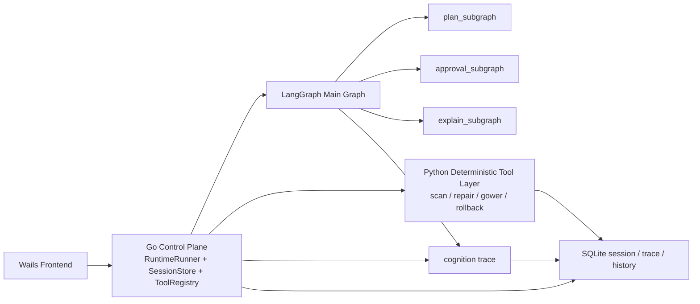

# LangGraph Deepening Execution Plan

## 1. Document Purpose

This document is the authoritative execution guide for the next LangGraph upgrade wave in this repo.
It focuses on four concrete gaps that are currently worth improving:

- subgraph split
- graph-level interrupt and resume
- richer cognition trace
- role-based cognitive collaboration

This file is intentionally standalone. A new window should be able to continue the work by reading only this file, `MEMO.md`, and the referenced modules.

## 2. Current Baseline (2026-03-17)

What is already in place:

- Go remains the control plane and source of truth for session lifecycle, tool execution, validation, rollback, persistence, and fallback.
- The Python LangGraph sidecar already exists and exposes `GET /health`, `POST /v1/plan`, and `POST /v1/explain`.
- The current cognition graph is a linear `intent -> strategy -> explain` flow.
- Go already records session and trace data in SQLite and can surface cognition summary back to the frontend.
- The system already supports sidecar health checks and deterministic fallback when the sidecar is unavailable.

What is still missing:

- no reusable subgraphs yet
- no graph-native interrupt and resume
- no node-level cognition trace exported from LangGraph into the main trace timeline
- no real conditional role collaboration inside the graph
- no persistent graph checkpoint storage for restart-safe resume

## 3. Design Principles

These rules must remain true during every phase:

1. Go control plane stays authoritative.
2. Deterministic tool execution stays outside LangGraph.
3. LangGraph only owns cognition, plan selection, explanation, and approval-related reasoning.
4. File writes, repair execution, validation, rescan, and rollback must remain in the deterministic tool layer.
5. Sidecar failure must never block the main workflow; deterministic fallback must remain available.
6. Do not implement the full 12-agent blueprint in one jump. Grow only the roles that improve real product behavior.
7. Each phase must be independently shippable and testable.
8. No phase is complete without restart safety, traceability, and explicit acceptance evidence.

## 4. Gap Assessment

| Area | Current Status | Target |
| --- | --- | --- |
| Subgraph split | Not started | Reusable cognition subgraphs with stable contracts |
| Interrupt / resume | Not started | Approval can pause and resume the same graph run |
| Cognition trace | Partial | Node timeline is persisted and visible beside Go trace |
| Role collaboration | Partial blueprint only | Conditional role activation inside the graph |

## 5. Target Architecture



Interpretation:

- Go still drives the end-to-end flow.
- LangGraph becomes a structured cognition runtime, not the main executor.
- Approval and explanation become first-class graph concerns.
- Trace from both sides is merged into one replayable timeline.

## 6. Phase Plan

### Phase 0: Contract Freeze and Baseline Instrumentation

Goal:
Create a stable contract before deepening LangGraph so later refactors do not break the current product path.

Implementation scope:

- freeze the current HTTP contracts for `/health`, `/v1/plan`, and `/v1/explain`
- define a graph state version field such as `graph_state_version`
- define stable IDs for `graph_run_id`, `graph_thread_id`, and `cognition_trace_id`
- define the minimum trace event schema that Go and Python will both understand
- document the current fallback invariants in code comments and tests

Suggested files:

- `appshell/core/langgraph_sidecar/schemas.py`
- `appshell/core/langgraph_sidecar/server.py`
- `appshell/backend/internal/agent/langgraph_types.go`
- `appshell/backend/internal/agent/langgraph_planner.go`
- `appshell/backend/internal/agent/cognition.go`
- `tests/langgraph_sidecar/test_server.py`
- `appshell/backend/internal/agent/langgraph_planner_test.go`

Acceptance criteria:

- existing `/v1/plan` and `/v1/explain` response shapes are explicitly documented in code or tests
- every LangGraph cognition response carries a versioned shape
- fallback behavior has test coverage and remains unchanged
- this phase introduces no product-facing behavior change

Do not do in this phase:

- do not add new role nodes yet
- do not introduce graph checkpoint storage yet
- do not change frontend behavior yet

### Phase 1: Subgraph Split

Goal:
Refactor the current linear graph into reusable subgraphs without changing observable behavior.

Target capabilities:

- `plan_subgraph`
- `approval_subgraph` placeholder with no runtime interrupt yet
- `explain_subgraph`
- shared graph state object used across subgraphs

Recommended implementation steps:

1. Extract the current `intent -> strategy -> explain` chain into a dedicated `plan_subgraph`.
2. Extract explanation-only flow into `explain_subgraph`.
3. Introduce an explicit graph state type that contains:
   - request snapshot
   - intent state
   - strategy state
   - approval state
   - explanation state
   - trace events
   - graph IDs
4. Keep the public endpoints unchanged so Go does not need to change behavior yet.
5. Add unit tests that assert subgraph output compatibility with the current linear graph.

Suggested files:

- `appshell/core/langgraph_sidecar/graph.py`
- `appshell/core/langgraph_sidecar/schemas.py`
- optional new package: `appshell/core/langgraph_sidecar/subgraphs/`
- `tests/langgraph_sidecar/test_graph.py`

Acceptance criteria:

- `/v1/plan` output remains backward compatible
- `/v1/explain` output remains backward compatible
- sidecar behavior is functionally equivalent to today for the same request payloads
- subgraph tests cover at least normal plan flow and explain-only flow
- Go fallback path remains green with no code changes required in the frontend

### Phase 2: Graph-Level Interrupt and Resume

Goal:
Make approval a first-class graph pause/resume capability instead of a separate ad-hoc step.

Target capabilities:

- graph can pause on approval-needed state
- graph can be resumed later with an approval decision
- restart-safe resume survives sidecar restart
- Go session state persists graph pause metadata

Recommended implementation steps:

1. Introduce persistent checkpoint storage for LangGraph.
2. Prefer a dedicated SQLite checkpoint store such as `outputs/appshell/langgraph_checkpoints.sqlite`.
3. Add graph pause payload fields:
   - `interrupt_token`
   - `graph_thread_id`
   - `graph_checkpoint_id`
   - `interrupt_reason`
   - `approval_prompt`
4. Add a new sidecar endpoint for resume, for example `POST /v1/approve`.
5. Extend Go session persistence so interrupted graph metadata is saved with the session.
6. Make approval resume continue the same graph run instead of recomputing from scratch.
7. Keep deterministic execution in Go after approval is granted.

Suggested files:

- `appshell/core/langgraph_sidecar/graph.py`
- `appshell/core/langgraph_sidecar/server.py`
- optional new file: `appshell/core/langgraph_sidecar/checkpoints.py`
- `appshell/backend/internal/agent/langgraph_client.go`
- `appshell/backend/internal/agent/langgraph_types.go`
- `appshell/backend/internal/agent/approval_runtime.go`
- `appshell/backend/internal/agent/sqlite_store.go`
- `appshell/backend/internal/agent/store.go`
- `tests/langgraph_sidecar/test_server.py`
- `appshell/backend/internal/agent/langgraph_client_test.go`
- `appshell/backend/internal/agent/sqlite_store_test.go`

Acceptance criteria:

- a high-risk session can return `interrupted` instead of immediately continuing
- approval metadata is persisted and can be queried through the existing session APIs
- after sidecar restart, the same interrupted session can still resume
- reject path does not trigger repair execution or rollback
- approve path resumes the same graph instead of recomputing a fresh one
- deterministic fallback still works when graph resume is unavailable

### Phase 3: Full Cognition Trace Mapping

Goal:
Make LangGraph produce a node-level cognition timeline that can be merged into the main Go trace.

Target capabilities:

- node enter / exit events
- candidate selection events
- approval decision events
- fallback and degraded-state events
- merged replay timeline in SQLite and presentation output

Recommended implementation steps:

1. Define a canonical cognition trace event schema shared by Go and Python.
2. Emit trace events from the sidecar for:
   - node start
   - node end
   - route selection
   - approval interrupt
   - approval resume
   - fallback reason
   - explain completion
3. Extend Go persistence to store these events with stable ordering.
4. Merge sidecar cognition trace into `agent_trace` instead of keeping only a summary.
5. Update presentation builders so the frontend can render:
   - cognition summary
   - node timeline
   - fallback reason
   - role activation list

Suggested files:

- `appshell/core/langgraph_sidecar/graph.py`
- optional new file: `appshell/core/langgraph_sidecar/trace.py`
- `appshell/backend/internal/agent/cognition.go`
- `appshell/backend/internal/agent/langgraph_planner.go`
- `appshell/backend/internal/agent/sqlite_store.go`
- `appshell/backend/internal/presentation/builder_agent.go`
- `appshell/backend/internal/presentation/types.go`
- `appshell/frontend/src/main.js`
- `tests/langgraph_sidecar/test_graph.py`
- `appshell/backend/internal/agent/cognition_test.go`
- `appshell/backend/internal/agent/sqlite_store_test.go`

Acceptance criteria:

- `ListAgentTrace` can show both Go execution trace and LangGraph cognition trace in one timeline
- trace payloads include node name, role label, status, and a short structured summary
- fallback and degraded reasons are visible in trace and presentation output
- session replay can explain why a candidate was selected or why approval was required
- tests assert event order, persistence, and merged rendering behavior

### Phase 4: Role-Based Cognitive Collaboration

Goal:
Upgrade the graph from a linear node chain into a conditional role-based cognition workflow.

Important constraint:
This is not a free-form multi-agent chat room. Roles collaborate through structured graph state, not through uncontrolled message passing.

Recommended initial role set:

- `intent_role`
- `strategy_role`
- `approval_role`
- `explainer_role`
- `memory_role`

Recommended routing rules:

- low-risk requests skip approval and go directly to explanation
- high-risk requests enter approval subgraph
- preference-heavy requests activate memory role before final strategy selection
- degraded or uncertain planning can activate a validator-style cognition review before explanation

Recommended implementation steps:

1. Keep `profile` and data scanning in Go and pass their output into LangGraph as structured context.
2. Add conditional routing in the graph instead of hard-coded linear edges only.
3. Introduce role-scoped state fields so each role writes to its own section of state.
4. Define which roles are optional and under what conditions they run.
5. Keep the number of active roles minimal for any given request.
6. Record activated roles in trace and final cognition summary.

Suggested files:

- `appshell/core/langgraph_sidecar/graph.py`
- `appshell/core/langgraph_sidecar/schemas.py`
- `appshell/backend/internal/agent/langgraph_planner.go`
- `appshell/backend/internal/agent/planning_flow.go`
- `appshell/backend/internal/agent/preferences.go`
- `appshell/backend/internal/presentation/builder_agent.go`
- `tests/langgraph_sidecar/test_graph.py`
- `appshell/backend/internal/agent/langgraph_planner_test.go`

Acceptance criteria:

- the graph supports at least three distinct routes:
  - low-risk fast path
  - approval path
  - preference-aware path
- trace clearly shows which roles ran and which roles were skipped
- selected strategy can be influenced by structured preference context
- no role can directly execute file writes or bypass Go validation
- sidecar unavailable path still falls back cleanly to deterministic planning

### Phase 5: Productization and Handoff Hardening

Goal:
Make the deeper LangGraph layer safe to operate, demo, and continue in future windows.

Target capabilities:

- startup checks include graph capability checks
- presentation shows graph summary and interrupt state cleanly
- developers can tell which phase is complete without rereading the whole repo
- the upgrade can continue incrementally without re-arguing architecture every time

Recommended implementation steps:

1. Extend startup checks to verify:
   - sidecar script exists
   - sidecar health endpoint works
   - checkpoint store is reachable
   - required graph endpoints are available
2. Expose graph capability flags in health/startup report.
3. Update presentation bundle to show:
   - graph engaged / fallback / degraded
   - interrupt pending
   - last resumed checkpoint
4. Keep this document updated with phase completion marks.
5. Update `MEMO.md` on every code change during this upgrade line.

Suggested files:

- `appshell/backend/cmd/wails/startup_checks.go`
- `appshell/backend/cmd/wails/app.go`
- `appshell/backend/internal/presentation/builder_agent.go`
- `appshell/frontend/src/main.js`
- `MEMO.md`
- this file

Acceptance criteria:

- startup report clearly distinguishes `healthy`, `degraded`, and `fallback-only` graph states
- frontend can surface interrupt-pending and resumed-session status
- this file and `MEMO.md` reflect the actual current phase
- a new developer window can resume work without rediscovering architecture decisions

## 7. File Ownership Map

Use this map to keep future changes scoped and coherent.

Sidecar cognition runtime:

- `appshell/core/langgraph_sidecar/graph.py`
- `appshell/core/langgraph_sidecar/server.py`
- `appshell/core/langgraph_sidecar/schemas.py`
- optional new sidecar helpers such as `checkpoints.py`, `trace.py`, `subgraphs/`

Go control plane integration:

- `appshell/backend/internal/agent/langgraph_types.go`
- `appshell/backend/internal/agent/langgraph_client.go`
- `appshell/backend/internal/agent/langgraph_manager.go`
- `appshell/backend/internal/agent/langgraph_planner.go`
- `appshell/backend/internal/agent/approval_runtime.go`
- `appshell/backend/internal/agent/cognition.go`
- `appshell/backend/internal/agent/sqlite_store.go`
- `appshell/backend/internal/agent/planning_flow.go`
- `appshell/backend/internal/agent/preferences.go`

Presentation and product surface:

- `appshell/backend/internal/presentation/builder_agent.go`
- `appshell/backend/internal/presentation/types.go`
- `appshell/backend/cmd/wails/startup_checks.go`
- `appshell/backend/cmd/wails/app.go`
- `appshell/frontend/src/main.js`

Tests:

- `tests/langgraph_sidecar/test_graph.py`
- `tests/langgraph_sidecar/test_server.py`
- `appshell/backend/internal/agent/langgraph_client_test.go`
- `appshell/backend/internal/agent/langgraph_manager_test.go`
- `appshell/backend/internal/agent/langgraph_planner_test.go`
- `appshell/backend/internal/agent/cognition_test.go`
- `appshell/backend/internal/agent/sqlite_store_test.go`

## 8. Required Test Gates Per Phase

Minimum command set after each meaningful phase increment:

```powershell
cd appshell/backend
go test ./...

cd ..\..
.\.venv-win\Scripts\python.exe -m pytest tests/langgraph_sidecar tests/python_engine -q
```

Additional expectations:

- add new tests before removing old behavior
- keep deterministic fallback covered in every phase
- do not mark a phase complete if restart and fallback paths are untested

## 9. Explicit Non-Goals

The following should not be treated as the next-step priority for this upgrade line:

- moving repair execution into LangGraph
- letting LangGraph write CSV or artifacts directly
- replacing deterministic validation or rollback with LLM judgment
- implementing the full 12-agent blueprint before the 5 role model is stable
- building free-form agent-to-agent chat without structured state contracts
- adding prompt complexity without adding traceability and restart safety

## 10. Resume Protocol For a New Window

When continuing this work in a fresh window, do the following in order:

1. Read `MEMO.md` and this file.
2. Confirm the current completed phase and the next incomplete phase.
3. Inspect the relevant files in the ownership map for that phase only.
4. Run the current Go and Python test suites before making changes.
5. Implement one phase milestone at a time.
6. Re-run tests and record the result in `MEMO.md`.
7. Update this file only when phase status or acceptance evidence changes.

## 11. Definition of Done For This Upgrade Line

This upgrade line is only truly complete when all of the following are true:

- LangGraph cognition is split into reusable subgraphs.
- Approval can interrupt and later resume the same graph run.
- Cognition trace is persisted at node level and merged with Go trace.
- Role-based cognition routes are active and test-covered.
- Sidecar restart does not destroy interrupted approval sessions.
- Deterministic fallback remains available for every critical failure mode.
- Presentation can explain both the Go execution path and the LangGraph cognition path.

## 12. Current Recommended Next Step

Start with Phase 0 and Phase 1 only.
Do not jump straight into approval resume or role expansion before subgraph boundaries and trace contracts are stabilized.
