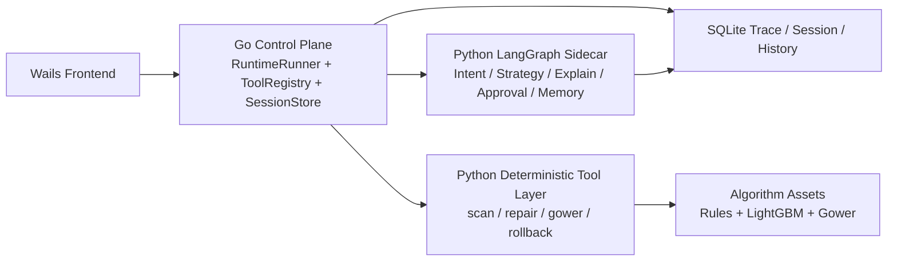
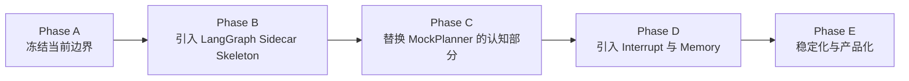

# LangGraph 接入升级路线图

## 文档定位

本文档是 [MULTI_AGENT_BLUEPRINT.md](./MULTI_AGENT_BLUEPRINT.md) 的补充路线图，专门回答一个更具体的问题：

**如果未来引入 LangGraph，应该如何在不推翻当前 Go + Python + Wails 架构的前提下完成升级。**

本文面向：

- 后续实现者
- 架构评审与技术答辩场景
- 需要判断“LangGraph 值不值得接、该接在哪一层”的协作者

本文不是 “LangGraph 重写方案”，而是 **LangGraph 增强方案**。

## 核心结论

- LangGraph 是 **Stage 5 之后的可选认知层升级路线**，不是对当前 deterministic 体系的替代。
- 当前 Go `RuntimeRunner + ToolRegistry + SessionStore` 继续保留为主控制平面。
- LangGraph 只进入 `Intent / Strategy / Explainer / Approval / Memory` 这类认知节点，不进入扫描、修复、验证、回滚这些执行节点。
- 接入原则必须符合当前产品理念：**不要求用户长 prompt，不向用户输出长段 AI 文本**，LLM 只做短输入、短输出、强结构化决策。

## 当前基线

当前仓库已经有一套可运行的 deterministic multi-agent 底座：

- Go 侧主控制平面位于 `appshell/backend/internal/agent/`
- `RuntimeRunner` 负责 `agent.session.plan / agent.session.execute / agent.session.auto`
- `Planner` 接口已存在，当前默认实现是 `NewMockPlanner()`
- `ToolRegistry` 已包装稳定工具：
  - `engine.scan_table`
  - `engine.repair_batch`
  - `engine.repair_with_gower`
  - `engine.rollback_batch`
- Python engine 仍通过稳定 JSON action 边界对外提供执行能力
- Wails 前端已经在 Stage 5 收敛为“一键上传，静候结果”的默认体验

这意味着：

- 当前系统已经具备 agent runtime、tool calling、trace、validation、rollback、presentation
- 当前真正缺少的不是“agent 框架”，而是**更强的认知层与更标准的有状态 LLM 工作流**

## 为什么考虑 LangGraph

LangGraph 对本项目的价值，不在于提升算法准确率，而在于增强以下能力：

- 编排层的状态管理
- checkpoint / 恢复 / replay
- interrupt 型人机确认点
- 长会话 memory
- 更标准的认知层图式工作流

LangGraph **不会自动提升**：

- `LightGBM` 的评分效果
- 规则扫描的检测质量
- Gower 邻居检索效果
- 修复执行本身的正确性

因此，LangGraph 的定位必须非常明确：

**它增强的是“认知层与编排层”，而不是“算法层与执行层”。**

## 什么保持 deterministic

以下模块继续由现有 Go + Python 工具层负责，不交给 LangGraph：

- `scan_file`
- `repair_batch`
- `repair_with_gower`
- `rollback_repair_batch`
- validation gate
- post-rescan
- 自动回滚

这些能力保持 deterministic 的原因是：

- 直接影响修复结果的正确性
- 直接影响文件写入安全
- 需要可重复、可测试、可回滚
- 需要明确权限边界

### 执行层保留原则

- LangGraph 不直接写 CSV
- LangGraph 不直接调用回滚作为最终权限源
- LangGraph 不绕过现有 validation / rollback 逻辑
- 最终写操作仍由 Go runtime 通过现有 tool registry 发起

## 什么适合交给 LangGraph

LangGraph 只进入认知层节点：

- `Intent Agent`
- `Strategy Agent`
- `Explainer Agent`
- `Approval Agent`
- `Preference / Memory Agent`

### 各节点职责

`Intent Agent`

- 理解少量用户输入
- 将“尽量保守修复”“优先不要动时间列”这类短约束翻译为结构化目标

`Strategy Agent`

- 在 `rule / gower / hybrid` 候选之间做认知层建议
- 输出结构化策略标签与原因码，而不是直接执行写入

`Explainer Agent`

- 将复杂结果压缩成一句结论
- 生成最多 3 条关键说明
- 支持图表标题、风险提示、摘要文案

`Approval Agent`

- 仅在高风险变更时触发短确认
- 不发起长对话，不把 UI 变成 prompt 输入器

`Preference / Memory Agent`

- 记录用户偏好
- 如“默认保守修复”“时间列默认不自动修改”“高风险列总要提醒”

## 最重要的架构决策

推荐架构固定为：

- `Wails Frontend`
- `Go Control Plane`
- `Python Deterministic Tool Layer`
- `Python LangGraph Sidecar`

### 决策解释

Go Control Plane 继续负责：

- 任务生命周期
- 工具执行
- validation
- rescan
- rollback
- 最终响应组装

Python LangGraph Sidecar 只负责：

- 认知层推理
- 结构化策略建议
- 短解释
- 偏好与确认流程

这保证了：

- 当前已稳定的执行闭环不被推翻
- LangGraph 接入失败时系统仍然可运行
- LLM 只影响“如何理解与表达”，不直接掌控“如何写文件”

## 为什么采用 Sidecar，而不是全量迁移

推荐接入方式固定为：

**本地 Python LangGraph sidecar，loopback HTTP/JSON 通信**

明确不采用：

- 把整个主流程迁到 LangGraph
- 让 LangGraph 直接替代当前 Python engine CLI

### 原因

1. 当前 Go 已是主控制面  
现有 `RuntimeRunner`、task service、history、presentation、Wails 绑定都在 Go 侧，迁移主流程会破坏已经完成的 Stage 1-5 收敛成果。

2. 当前 Python engine 已有稳定 JSON action 边界  
扫描、修复、回滚等动作已经通过稳定协议暴露，没有必要为了 LangGraph 改写整条执行链。

3. LangGraph 更适合作为认知层 service  
它的最大价值在于 graph orchestration、memory、interrupt、structured reasoning，而不是替代执行工具层。

4. Sidecar 更利于降级  
当 LangGraph sidecar 不可用时，可以立即回退 `MockPlanner` / deterministic planner，而不会影响现有一键闭环安全能力。

## 短输入 / 短输出原则

LangGraph 接入必须服从当前产品理念：

- 不要求用户输入长 prompt
- 默认界面仍是“选文件 + 极少数短确认”
- 不要求用户写复杂自然语言指令
- 不向用户输出大段 AI 文本

### 固定输入约束

- 默认输入来自现有会话上下文，而不是自由 prompt
- 用户输入最多是：
  - 选择文件
  - 极少数策略偏好
  - 必要时的短确认

### 固定输出约束

LangGraph 侧返回结果必须受限为短结构：

- `strategy_label`
- `risk_note`
- `one_sentence_summary`
- `short_bullets`，最多 3 条
- `json_only_planning_fields`

### 明确禁止

- 大段自由文本报告
- 把解释系统退化成长篇 AI 文案生成器
- 把交互模式改成长 prompt 输入器

## 未来接口方向

本次不改代码，但未来接口方向必须先定稿。

### Go 侧未来抽象

- `LangGraphClient`
- `LangGraphPlanner`，实现现有 `Planner` 接口
- 可选 `LangGraphExplainer`

### Python Sidecar 接口

- `GET /health`
- `POST /v1/plan`
- `POST /v1/explain`
- `POST /v1/approve`

### 请求体字段方向

- `session_id`
- `goal`
- `scan_summary`
- `candidate_previews`
- `safety_context`
- `user_preferences`
- `output_constraints`

### 响应体字段方向

- `strategy_label`
- `selected_candidate_id`
- `reason_codes`
- `one_sentence_summary`
- `short_bullets`
- `approval_needed`

### 接口边界原则

- sidecar 只输出建议和解释
- sidecar 不输出最终写入决定
- sidecar 不拥有最终执行权限
- 最终执行、验证、回滚仍由 Go control plane 决定

## 当前到目标态的阶段路线

### Phase A: 保持现状，先冻结边界

- 继续复用现有 `Planner` 接口
- 继续复用 Go runtime
- 不动 deterministic tool layer
- 明确 LangGraph 未来只替换 `Planner` 的认知实现，不替换工具执行

阶段完成标志：

- 当前 `MockPlanner` 行为与 `Planner` 边界不再扩散
- Go control plane 和 Python tool layer 的职责分工固定

### Phase B: 引入 LangGraph Sidecar Skeleton

- 新增本地 Python sidecar
- 先实现：
  - `GET /health`
  - 空 graph
  - mock `plan` 返回
- 打通 Go -> LangGraph 的最小 JSON 调用

阶段完成标志：

- Go 能探测 sidecar 健康状态
- Go 能向 sidecar 发起 mock planning 调用
- sidecar 不可用时系统自动回退现有 planner

### Phase C: 替换 MockPlanner 的认知部分

- 先让 LangGraph 接管：
  - `Intent`
  - `Strategy`
  - `Explain`
- 继续由 Go 执行：
  - `scan`
  - `repair`
  - `validate`
  - `rollback`

阶段完成标志：

- `LangGraphPlanner` 成为可选 planner 实现
- explanation 从模板式升级为短结构化认知输出
- 不改变现有安全闭环

### Phase D: 引入 Interrupt 与 Memory

- 高风险字段变更时引入短确认
- 记住用户偏好，例如：
  - 默认保守修复
  - 时间列不要动
  - 某些列必须审批

阶段完成标志：

- 高风险步骤支持 interrupt
- 会话 memory 和持久化偏好开始接入

### Phase E: 稳定化与产品化

- 接入 trace 映射
- 与 presentation 协同
- 做 sidecar 容错、降级与故障恢复
- 形成生产可用的认知层升级能力

阶段完成标志：

- sidecar 不可用时系统自动回退 deterministic planner
- presentation 能统一接入 LangGraph 产生的短解释
- trace 中能同时看到 Go 决策轨迹和 LangGraph 认知轨迹摘要

## 风险与非目标

### 非目标

- 不把当前系统改成 LangGraph-first
- 不让 LangGraph 直接写文件
- 不把 validation / rollback 交给 LLM
- 不把 UI 变成长 prompt 输入器
- 不把结果页变成长篇 AI 报告

### 风险

- 新增 sidecar 进程治理复杂度
- 外部 LLM API 成本和延迟
- 供应商锁定风险
- trace 双系统对齐问题

### 固定降级策略

- LangGraph sidecar 异常时回退 `MockPlanner` / deterministic planner
- sidecar 故障不影响现有 Stage 5 一键流程的安全闭环
- 降级时仍保留当前 `scan -> repair -> validate -> rollback` 能力

## 对实现者的明确结论

未来若接入 LangGraph，实现者应直接遵守以下决定：

- 不重写 `RuntimeRunner`
- 不重写 Python engine CLI
- 不把工具执行迁到 LangGraph
- 只把 `Planner` 的认知部分替换为 `LangGraphPlanner`
- 只在认知节点中使用 LLM
- 所有用户可见输出仍保持“短输入、短输出、强结构化”

## 验收清单

当这条路线真正进入实现阶段，验收必须至少能回答清楚：

- 为什么 LangGraph 只该接认知层
- 哪些模块必须保持 deterministic
- LangGraph 与当前 Go runtime 如何共存
- 为什么采用 sidecar，而不是全量迁移
- 如何保证不出现长 prompt / 长文本输出

如果某个实现方案不能同时满足以上五点，则不应视为本文档定义的正确升级方向。
